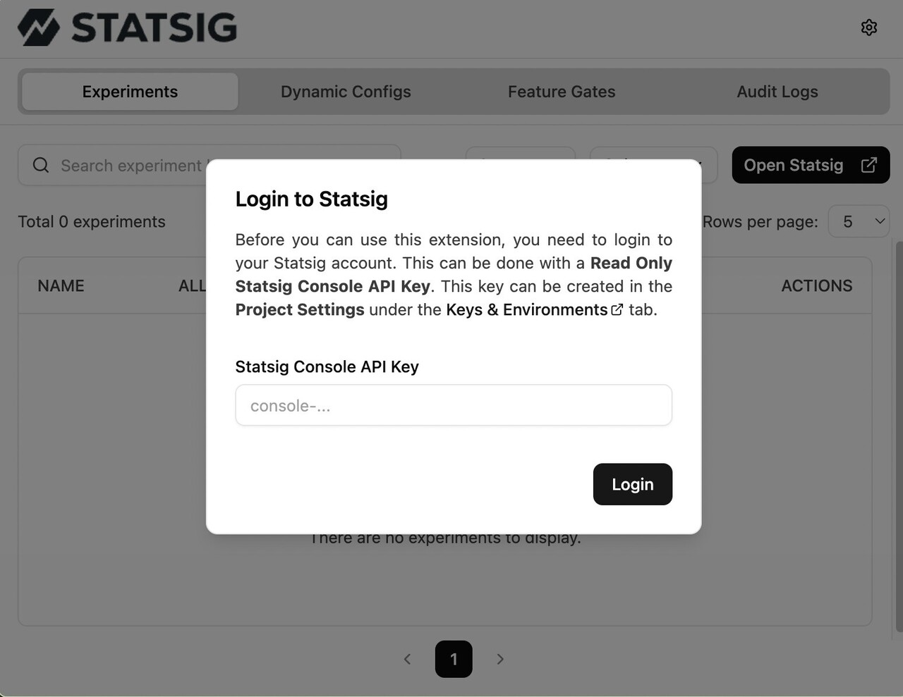
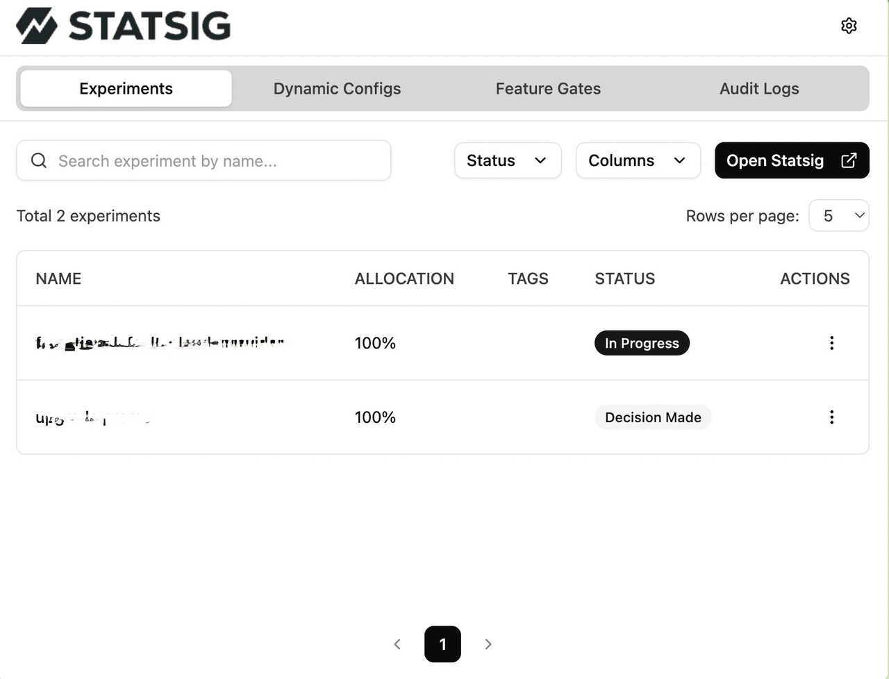
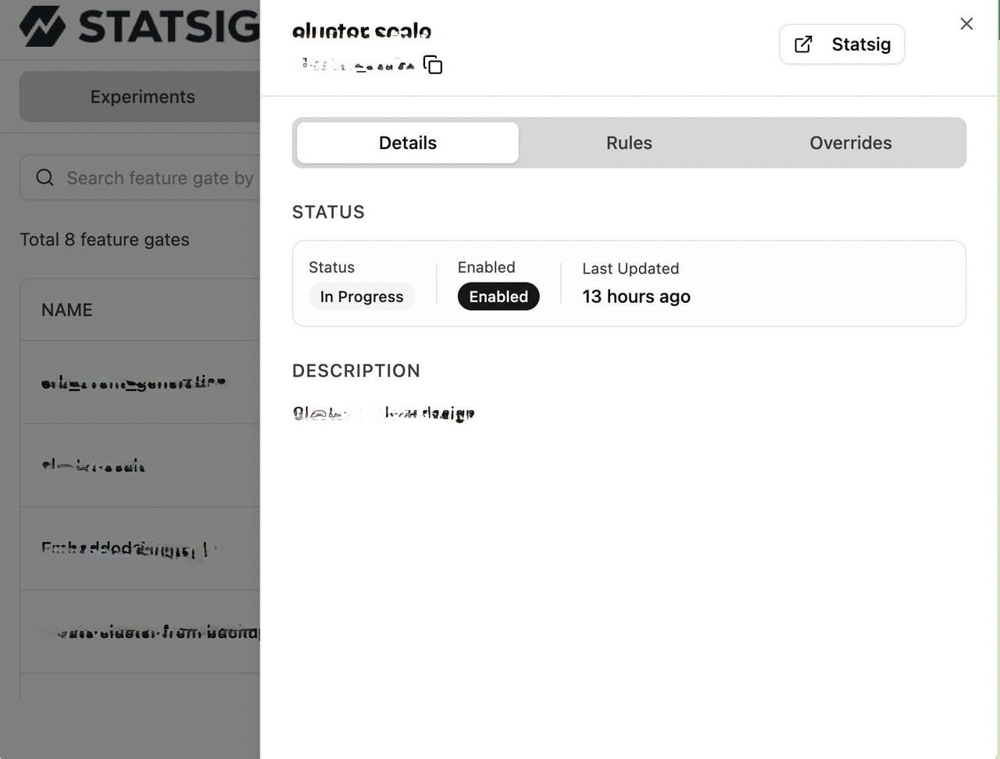
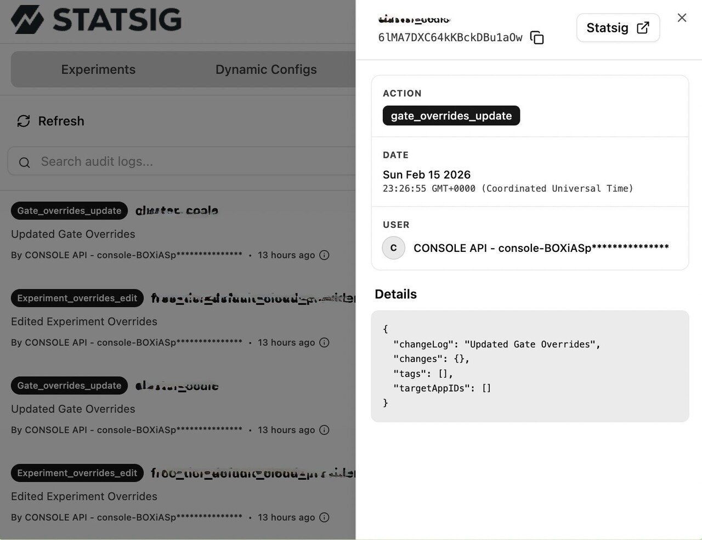

# Statsig Browser Extension

[](https://statsig.com)
[](https://chromewebstore.google.com/detail/statsig-browser-extension/dcoabmhfndkoogomhielncgjbaomfkmh)
[](https://addons.mozilla.org/en-GB/firefox/addon/statsig-browser-extension/)

A powerful browser extension for managing Statsig feature gates, experiments, and dynamic configs directly from your browser.

## 🚀 What is this?

This extension bridges the gap between the [Statsig Console](https://console.statsig.com) and your local development or production environment. It allows developers, PMs, and QA to debug and test feature flags and experiments in real-time without changing code or dashboard settings.

> **Note**: This extension allows you to inspect current configurations and apply overrides using your **Statsig Console API Key**. These overrides are applied via the Statsig API, effectively changing them in the project context (depending on the scope of the override, usually user or gate specific), not just a local browser hack. It requires a Write-access Console API Key to perform these actions.

**Key Capabilities:**

- **Debug Feature Flags**: Instantly see why a gate is returning `false` or `true`.
- **Test Variations**: Force a specific experiment group to verify UI changes on the fly.
- **Audit SDK State**: Ensure the SDK is initialized with the correct keys and user object.

## ✨ Features

- **Feature Gates**: View current status and apply overrides via Statsig API.
- **Experiments**: Monitor active experiments and force specific variations via Statsig API overrides.
- **Dynamic Configs**: Inspect dynamic configurations and their evaluated values.
- **Audit Logs**: Track recent changes and user activities within the session.
- **Overrides**: Create and manage overrides using your Statsig Console API Key.
- **User Details**: View the current Statsig User object (UserID, Email, Custom IDs, etc.).

## 📖 How to Use

1.  **Install the Extension**: Download it from your browser's extension store (links above) or load it as an unpacked extension.
2.  **Navigate to your App**: Open any web application that has the Statsig SDK initialized.
3.  **Open the Extension**: Click the Statsig icon in your browser toolbar.
    - _Note: The extension automatically detects the Statsig SDK on the page._
4.  **Configure API Key**: Go to Settings and enter your **Statsig Console API Key** (Write access required for overrides).
5.  **Interact**:
    - **Toggle Gates**: Click on a gate to override its value (requires Console API Key).
    - **Change Groups**: Select a different experiment group to see how the app behaves.
    - **Review Configs**: Check if your dynamic configs are delivering the expected JSON.

## � Screenshots

### 1. Setup

When you first open the extension, you'll be prompted to enter your Statsig Console API Key to enable read/write access.



### 2. Main Dashboard

View all your Feature Gates, Dynamic Configs, and Experiments in one place. You can see their current status and values.



### 3. Entity Details

Click on any item to open a **Side Sheet** with detailed information, including its rules, return values, and evaluation details. You can also apply overrides directly from these sheets.



### 4. Audit Log

Track all changes and user activities within the session to ensure everything is working as expected.



## �🛠 Tech Stack

- **Framework**: [WXT](https://wxt.dev/) (Web Extension Tools)
- **UI Library**: [shadcn/ui](https://ui.shadcn.com/) (built on Radix UI)
- **Styling**: [Tailwind CSS v4](https://tailwindcss.com/)
- **Data Fetching**: [wretch](https://github.com/elbywan/wretch) (base) & [TanStack Query v5](https://tanstack.com/query/latest) (management)
- **State Management**: [Zustand](https://github.com/pmndrs/zustand)
- **Testing**: [Vitest](https://vitest.dev/)
- **Linting & Formatting**: [oxlint](https://oxlint.dev/) & [oxfmt](https://github.com/oxc-project/oxc)
- **Icons**: Lucide React

## 💻 Development

### Prerequisites

- Node.js (v24+)
- pnpm (v10+)

### Installation

1. Clone the repository
2. Install dependencies:
   ```bash
   pnpm install
   ```

### Running in Development Mode

```bash
pnpm dev
# or for specific browsers
pnpm dev:chrome
pnpm dev:firefox
```

This will start the development server and open a browser instance with the extension loaded.

### Building for Production

```bash
pnpm build
# or
pnpm zip:all
```

The output artifacts will be in the `.output/` directory.

## 📂 Project Structure

- `entrypoints/`: Extension entry points (popup, background, content scripts, and statsig-detector).
- `src/components/`:
  - `sheets/`: Detailed side sheets for Gates, Experiments, and Configs.
  - `modals/`: Authentication and override management modals.
  - `tables/`: Data tables for listing entities.
  - `ui/`: Reusable primitive components (shadcn/ui).
  - `audit-logs/`: Components specific to the audit trail.
- `src/hooks/`: Custom React hooks for data fetching (TanStack Query), storage, and logic.
- `src/handlers/`: API interaction logic and Statsig mutations using `wretch`.
- `src/store/`: Zustand stores for UI and settings state.
- `src/types/`: TypeScript definitions and API types.
- `src/lib/`: Core utilities, storage wrappers, and query client configuration (including the `wretch` base).

## 🤝 Contributing

Please read [CONTRIBUTING.md](CONTRIBUTING.md) for details on our code of conduct, and the process for submitting pull requests to us.

## 📦 Release & Publishing

We use `semantic-release` to automate our release process. For detailed instructions on how to publish the extension to the Chrome Web Store and Firefox Add-ons, please refer to [docs/publishing.md](docs/publishing.md).
