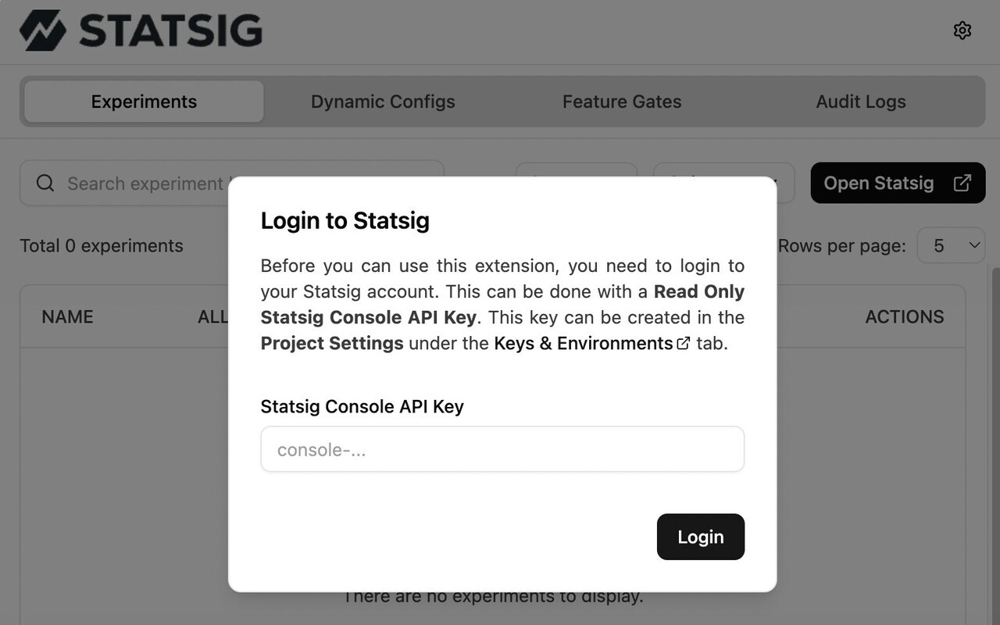
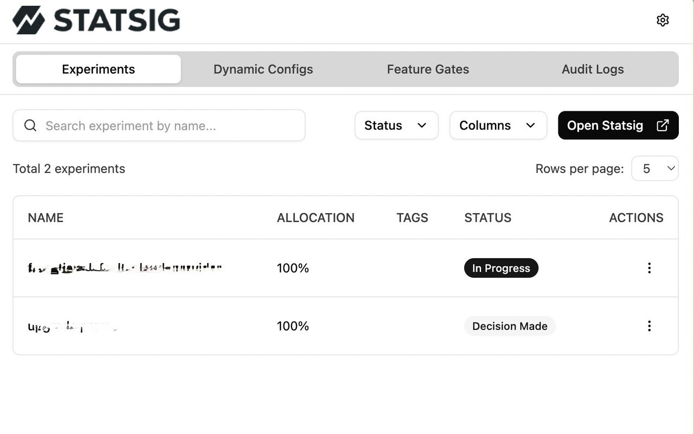
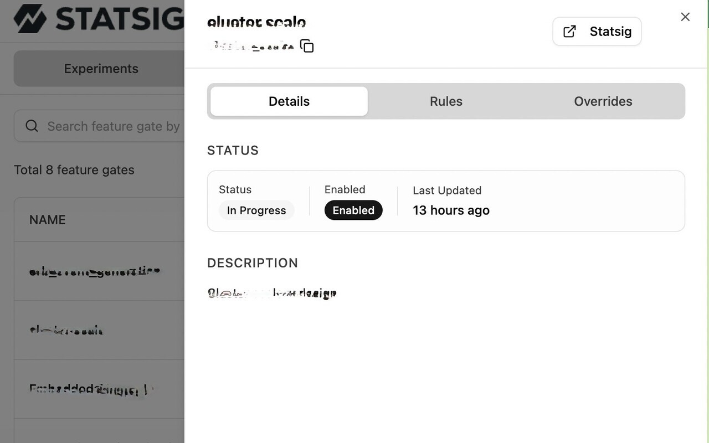
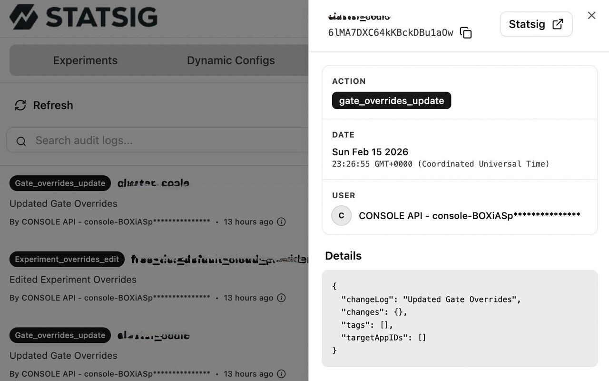

# Statsig Browser Extension

[](https://codecov.io/gh/d0whc3r/statsig-browser-extension)
[](https://sonarcloud.io/summary/new_code?id=d0whc3r_statsig-browser-extension)
[](https://chromewebstore.google.com/detail/statsig-browser-extension/dcoabmhfndkoogomhielncgjbaomfkmh)
[](https://addons.mozilla.org/en-GB/firefox/addon/statsig-browser-extension/)

A powerful browser extension for managing Statsig feature gates, experiments, and dynamic configs directly from your browser.

## 🚀 What is this?

This extension bridges the gap between the [Statsig Console](https://console.statsig.com) and your local development or production environment. It allows developers, PMs, and QA to debug and test feature flags and experiments in real-time without changing code or dashboard settings.

> **Note**: This extension allows you to inspect current configurations and apply overrides using your **Statsig Console API Key**. These overrides are applied via the Statsig API, effectively changing them in the project context (depending on the scope of the override, usually user or gate specific), not just a local browser hack. It requires a Write-access Console API Key to perform these actions.

**Key Capabilities:**

- **Debug Feature Flags**: Instantly see why a gate is returning `false` or `true`.
- **Test Variations**: Force a specific experiment group to verify UI changes on the fly.
- **Audit SDK State**: Ensure the SDK is initialized with the correct keys and user object.

## ✨ Features

- **Feature Gates**: View status, evaluation rules, health checks, and apply overrides via Statsig Console API
- **Experiments**: Monitor active experiments, view hypothesis, force variations, and manage user-level overrides
- **Dynamic Configs**: Inspect evaluated config values, rules, and underlying JSON structure
- **Audit Logs**: Session-based activity trail with filtering, user attribution, and detailed change views
- **User Details**: View and copy the full Statsig user object: UserID, Stable ID, email, country, locale, environment tier, custom properties, and private attributes
- **Environment Switching**: Toggle between Statsig environments (production, development, etc.) directly from the UI
- **Override Management**: Create, edit, and remove gate/experiment overrides with support for user, environment, and account-level scopes
- **Search & Filter**: Real-time fuzzy search across gates, experiments, and configs with persistent table state (sorting, pagination, column visibility)
- **Health Checks**: Visual health check indicators on gates showing SDK evaluation status
- **Dark Mode**: System-aware theme toggle with light/dark/system options
- **Storage Options**: Choose between localStorage or cookies for persisting extension settings
- **React DevTools**: Content script injection enables full React component inspection

## 📖 How to Use

1.  **Install the Extension**: Download it from your browser's extension store (links above) or load it as an unpacked extension.
2.  **Navigate to your App**: Open any web application that has the Statsig SDK initialized.
3.  **Open the Extension**: Click the Statsig icon in your browser toolbar.
    - _Note: The extension automatically detects the Statsig SDK on the page._
4.  **Configure API Key**: Go to Settings and enter your **Statsig Console API Key** (Write access required for overrides).
5.  **Interact**:
    - **Toggle Gates**: Click on a gate to override its value (requires Console API Key).
    - **Change Groups**: Select a different experiment group to see how the app behaves.
    - **Review Configs**: Check if your dynamic configs are delivering the expected JSON.

## 📸 Screenshots

### 1. Setup

When you first open the extension, you'll be prompted to enter your Statsig Console API Key to enable read/write access.



### 2. Main Dashboard

View all your Feature Gates, Dynamic Configs, and Experiments in one place. You can see their current status and values.



### 3. Entity Details

Click on any item to open a **Side Sheet** with detailed information, including its rules, return values, and evaluation details. You can also apply overrides directly from these sheets.



### 4. Audit Log

Track all changes and user activities within the session to ensure everything is working as expected.



## 🛠️ Tech Stack

- **Framework**: [WXT](https://wxt.dev/) (Web Extension Toolkit)
- **UI Library**: [shadcn/ui](https://ui.shadcn.com/) (built on Radix UI)
- **Styling**: [Tailwind CSS v4](https://tailwindcss.com/)
- **Data Fetching**: [wretch](https://github.com/elbywan/wretch) + [TanStack Query v5](https://tanstack.com/query/latest)
- **State Management**: [Zustand](https://github.com/pmndrs/zustand)
- **Forms**: [React Hook Form](https://react-hook-form.com/) + [Zod](https://zod.dev/) v4
- **Testing**: [Vitest](https://vitest.dev/) + [Testing Library](https://testing-library.com/)
- **Linting & Formatting**: [oxlint](https://oxlint.dev/) + [oxfmt](https://github.com/oxc-project/oxfmt)
- **Icons**: [Lucide React](https://lucide.dev/)
- **CI/CD**: GitHub Actions, [semantic-release](https://github.com/semantic-release/semantic-release), [Codecov](https://codecov.io/), [SonarCloud](https://sonarcloud.io/)
- **Package Manager**: [pnpm](https://pnpm.io/)

## 💻 Development

### Prerequisites

- Node.js (v24+)
- pnpm (v10+)

### Installation

1. Clone the repository
2. Install dependencies:
   ```bash
   pnpm install
   ```

### Running in Development Mode

```bash
pnpm dev
# or for specific browsers
pnpm dev:chrome
pnpm dev:firefox
```

This will start the development server and open a browser instance with the extension loaded.

### Building for Production

```bash
pnpm build
# or
pnpm zip:all
```

The output artifacts will be in the `.output/` directory.

## 📂 Project Structure

- `entrypoints/`: Extension entry points (`popup/index.html`, `background.ts`, `content.ts`, `statsig-detector.ts`)
- `src/components/`: React components
  - `audit-logs/`: Audit log list, filters, and row components
  - `common/`: Shared components (context cards, override forms, dialogs, tables)
  - `layout/`: Header, tabs, and global modal wrapper
  - `modals/`: Auth form and modal
  - `pages-experiment/`: Experiment override page, form, row, and context card
  - `pages-gate-overrides/`: Gate override page, section, modal, row, and context card
  - `sheets/`: Detail sheets for gates, experiments, and configs
- `src/handlers/`: API interaction logic (gate/experiment overrides, user details, initial login)
- `src/hooks/`: TanStack Query hooks, storage hooks, mutation logic, and form hooks
- `src/lib/`: Core utilities (`fetcher`, `rules`, `storage`, `utils`, `query-client`)
- `src/store/`: Zustand stores (`use-settings-store`, `use-ui-store`, `use-context-store`)
- `src/types/`: TypeScript definitions (Statsig API types, audit logs, gates, experiments)
- `src/utils/`: Utility functions (audit log helpers, etc.)
- `src/tests/`: Test setup, unit tests, and integration tests

## 🤝 Contributing

Please read [CONTRIBUTING.md](CONTRIBUTING.md) for details on our code of conduct, and the process for submitting pull requests to us.

## 📦 Release & Publishing

We use `semantic-release` to automate our release process. For detailed instructions on how to publish the extension to the Chrome Web Store and Firefox Add-ons, please refer to [docs/publishing.md](docs/publishing.md).
