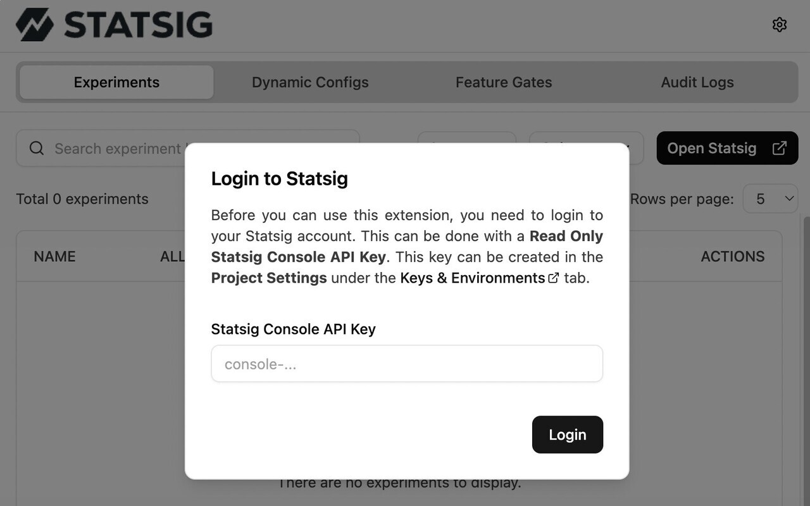
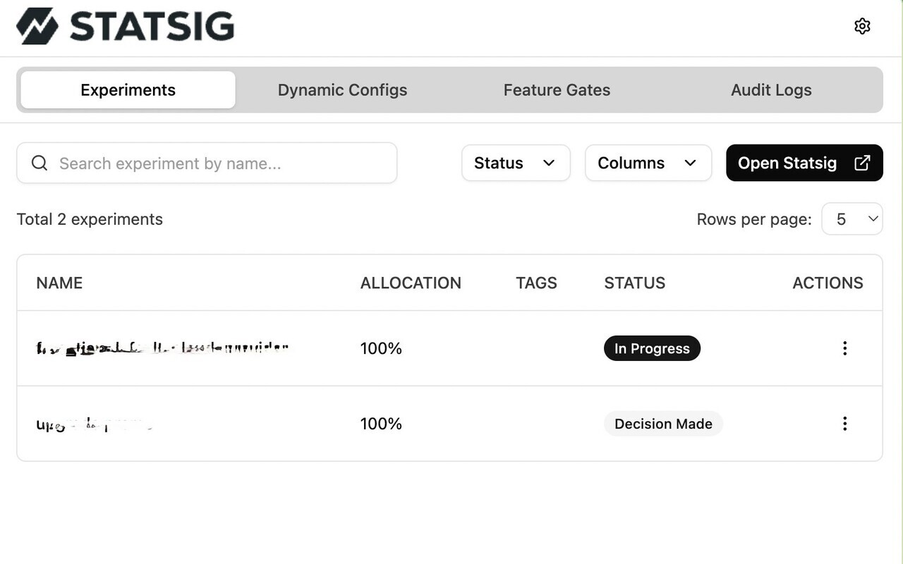
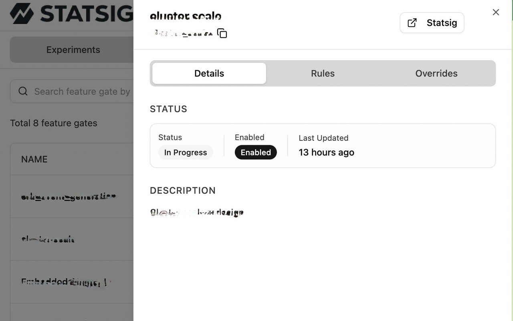
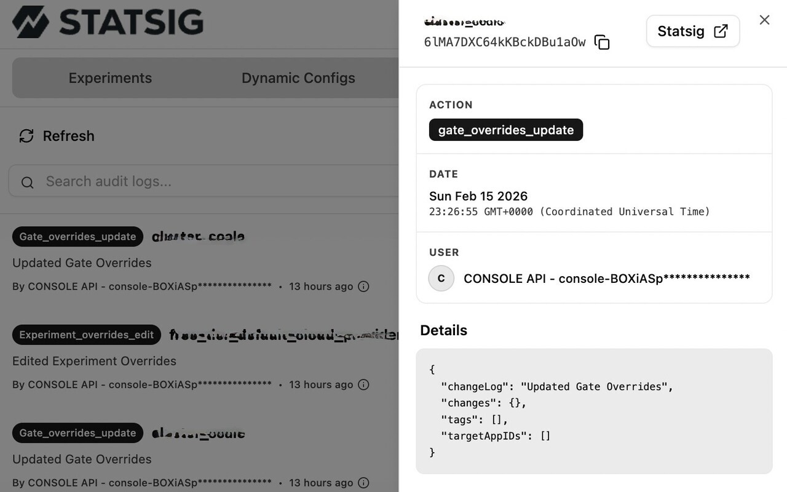

# Statsig Browser Extension

Inspect and override Statsig feature gates, experiments, and dynamic configs from your browser toolbar — no code changes, no dashboard round-trips.

Useful when you need to see why a gate returns `false`, force an experiment group to check a UI variant, or confirm the SDK initialized with the user object you expected.

> **Overrides are real.** They are applied through the Statsig API with your Console API Key, so they affect the project (scoped to a user, environment, or account), not just your local browser. Write access is required to apply them.

## Getting Started

1. **Install** from the [Chrome Web Store](https://chromewebstore.google.com/detail/statsig-browser-extension/dcoabmhfndkoogomhielncgjbaomfkmh) or [Firefox Add-ons](https://addons.mozilla.org/en-GB/firefox/addon/statsig-browser-extension/).
2. **Open a page** running the Statsig SDK. The extension detects it automatically.
3. **Click the Statsig icon** in your toolbar.
4. **Add your Console API Key** in Settings (write access needed for overrides).
5. **Start working**: click a gate to override it, pick a different experiment group, or check what JSON a dynamic config returns.

Multiple Statsig projects? Add one Console API key per project under **Settings → Statsig Projects**. The extension matches the SDK key it finds on the page and activates the right project. To manage a project from a page that doesn't use it, pick it from the project chip in the header (lasts until the popup closes). Details: [project key detection](docs/project-key-detection.md).

## Features

- **Feature Gates** — status, evaluation rules, health checks, and overrides
- **Experiments** — active experiments, hypotheses, forced variations, user-level overrides
- **Dynamic Configs** — evaluated values, rules, and raw JSON
- **User Details** — full Statsig user object (UserID, Stable ID, email, country, locale, environment tier, custom and private attributes) with copy support
- **Override Management** — create, edit, and remove overrides at user, environment, or account scope
- **Environment Switching** — jump between production, development, and other tiers from the UI
- **Audit Logs** — session activity trail with filtering, user attribution, and change details
- **Search & Filter** — fuzzy search across everything, with sorting, pagination, and column visibility remembered
- **Dark Mode** — light, dark, or follow the system
- **React DevTools** — component inspection enabled on the page

## Screenshots

|                  Setup                  |               Dashboard                |
| :-------------------------------------: | :------------------------------------: |
|  |  |

|               Entity details               |                  Audit log                  |
| :----------------------------------------: | :-----------------------------------------: |
|  |  |

## Privacy & Permissions

Your Console API Key is stored locally in browser extension storage and is only sent to the Statsig API. See [permissions justification](docs/permissions-justification.md) for why each permission is requested.

## Documentation

- [Contributing](CONTRIBUTING.md) — local setup, code standards, commits, and PRs
- [Architecture](docs/architecture.md) — tech stack and project structure
- [Project key detection](docs/project-key-detection.md) — how the active project is chosen
- [Publishing](docs/publishing.md) — release and store submission
- [Changelog](CHANGELOG.md)

## License

See [LICENSE](LICENSE).
